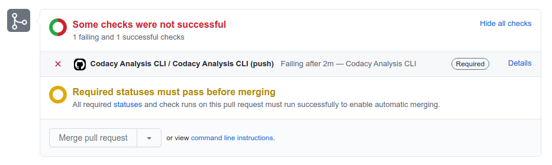

# Codacy GitHub Action

[](https://www.codacy.com/gh/codacy/codacy-analysis-cli-action/dashboard?utm_source=github.com&utm_medium=referral&utm_content=codacy/codacy-analysis-cli-action&utm_campaign=Badge_Grade)

GitHub Action for running Codacy static analysis on [over 30 supported languages](https://docs.codacy.com/getting-started/supported-languages-and-tools/) and returning identified issues in the code.

<br/>

<a href="https://www.codacy.com" target="_blank"></a>

<br/>

[Codacy](https://www.codacy.com/) is an automated code review tool that makes it easy to ensure your team is writing high-quality code by analyzing more than 30 programming languages such as PHP, JavaScript, Python, Java, and Ruby. Codacy allows you to define your own quality rules, code patterns and quality settings you'd like to enforce to prevent issues on your codebase.

The Codacy GitHub Action supports the following scenarios:

-   **[Analysis with default settings](#analysis-with-default-settings):** Analyzes each commit and pull request and fails the workflow if it finds issues in your code.
-   **[Integration with GitHub code scanning](#integration-with-github-code-scanning):** Analyzes each commit and pull request and uploads the results to GitHub, which displays the identified issues under your repository's tab **Security**.
-   **[Integration with Codacy for client-side tools](#integration-with-codacy-for-client-side-tools):** Analyzes each commit and pull request using one of Codacy's client-side tools and uploads the results to Codacy, which displays the identified issues in UI dashboards and can also report the status of the analysis on your pull requests.

## Analysis with default settings

By default, the Codacy GitHub Action:

-   Analyzes each commit or pull request by running all supported static code analysis tools for the languages found in your repository.
-   Prints the analysis results on the console, which is visible on the GitHub Action's workflow panel.  
-   Fails the workflow if it finds at least one issue in your code.



To use the GitHub Action with default settings, add the following to a file `.github/workflows/codacy-analysis.yaml` in your repository:

```yaml
name: Codacy Analysis CLI

on: ["push"]

jobs:
  codacy-analysis-cli:
    name: Codacy Analysis CLI
    runs-on: ubuntu-latest
    steps:
      - name: Checkout code
        uses: actions/checkout@main

      - name: Run Codacy Analysis CLI
        uses: codacy/codacy-analysis-cli-action@master
```

## Integration with GitHub code scanning

Integrate the Codacy GitHub Action with [GitHub code scanning](https://docs.github.com/github/finding-security-vulnerabilities-and-errors-in-your-code/about-code-scanning) to display the analysis results on your repository under the tab **Security**, page **Code scanning alerts**.

In this scenario, the GitHub Action:

-   Analyzes each commit and pull request to the `master` or `main` branch by running all supported static code analysis tools for the languages found in your repository.
-   Outputs the analysis results to a file `results.sarif`, which is then uploaded to GitHub.


To use the GitHub Action with GitHub code scanning integration, add the following to a file `.github/workflows/codacy-analysis.yaml` in your repository:

```yaml
name: Codacy Security Scan

on:
  push:
    branches: [ "master", "main" ]
  pull_request:
    branches: [ "master", "main" ]

jobs:
  codacy-security-scan:
    name: Codacy Security Scan
    runs-on: ubuntu-latest
    steps:
      - name: Checkout code
        uses: actions/checkout@main

      - name: Run Codacy Analysis CLI
        uses: codacy/codacy-analysis-cli-action@master
        with:
          output: results.sarif
          format: sarif
          # Adjust severity of non-security issues
          gh-code-scanning-compat: true
          # Force 0 exit code to allow SARIF file generation
          # This will handover control about PR rejection to the GitHub side
          max-allowed-issues: 2147483647
      
      # Upload the SARIF file generated in the previous step
      - name: Upload SARIF results file
        uses: github/codeql-action/upload-sarif@main
        with:
          sarif_file: results.sarif
```

## Integration with Codacy for client-side tools

Use the GitHub Action to run any of the [containerized Codacy client-side tools](https://docs.codacy.com/related-tools/local-analysis/client-side-tools/) and upload the results of the analysis to Codacy.

In this scenario, the GitHub action:

-   Analyzes each commit or pull request by running a specific client-side tool with the configurations that you defined on Codacy.
-   Uploads the analysis results to Codacy.

After this, Codacy displays the results of the analysis of your commits and pull requests on the UI dashboards, and optionally reports the status of the analysis directly on your GitHub pull requests.


To use the GitHub Action with Codacy integration:

1.  On Codacy, enable **Run analysis through build server** in your repository **Settings**, tab **General**, **Repository analysis**.

    This setting enables Codacy to wait for the results of the local analysis before resuming the analysis of your commits.

2.  On Codacy, obtain one of the following tokens:

    -   [Project API Token](https://docs.codacy.com/codacy-api/api-tokens/#project-api-tokens)

        You need the Project API Token to allow the Codacy Analysis CLI to authenticate to Codacy when reporting the analysis results.

    -   [Account API Token](https://docs.codacy.com/codacy-api/api-tokens/#account-api-tokens)

        You need the Account API Token to allow the Codacy Analysis CLI to authenticate to Codacy when reporting the analysis results.

        Usually you want to use the Project API Token but to help with automation you can use the Account API Token since it will work for multiple repositories.

3.  On GitHub, store the API Token as an [encrypted secret for your repository](https://docs.github.com/actions/reference/encrypted-secrets#creating-encrypted-secrets-for-a-repository) with the correct name, for the Project API Token use `CODACY_PROJECT_TOKEN` and for Account API Token use `CODACY_API_TOKEN`.

    Do this to avoid committing the secret token to your repository.

4.  Add the following to a file `.github/workflows/codacy-analysis.yaml` in your repository, where `<CLIENT_SIDE_TOOL_NAME>` is the name of the containerized client-side tool that the Codacy Analysis CLI will run locally, or do not pass it to run all tools.

    ```yaml
    name: Codacy Analysis CLI

    on: ["push"]

    jobs:
      codacy-analysis-cli:
        name: Codacy Analysis CLI
        runs-on: ubuntu-latest
        steps:
          - name: Checkout code
            uses: actions/checkout@main

          - name: Run Codacy Analysis CLI
            uses: codacy/codacy-analysis-cli-action@master
            with:
              tool: <CLIENT_SIDE_TOOL_NAME>
              project-token: ${{ secrets.CODACY_PROJECT_TOKEN }}
              # or
              # api-token: ${{ secrets.CODACY_API_TOKEN }}
              upload: true
              max-allowed-issues: 2147483647
    ```

5.  Optionally, [enable standalone client side tools](https://docs.codacy.com/related-tools/local-analysis/client-side-tools/) by passing the following options to the action.

    ```yaml
    name: Codacy Analysis CLI

    on: ["push"]

    jobs:
      codacy-analysis-cli:
        name: Codacy Analysis CLI
        runs-on: ubuntu-latest
        steps:
          # ...
          - name: Run Codacy Analysis CLI
            uses: codacy/codacy-analysis-cli-action@master
            with:
              # ...
              run-gosec: "true"
<<<<<<< HEAD
              run-staticcheck: "true"
=======
>>>>>>> 68cb35d (feature: Add GoSec support)
    ```

    In case you just want to run the standalone client side tools you can disable the dockerized tools by passing the `run-docker-tools: "false"` to the action.

6.  Optionally, [enable the GitHub integration](https://docs.codacy.com/repositories-configure/integrations/github-integration/) on Codacy to have information about the analysis of the changed files directly on your pull requests.

## Extra configurations

The Codacy GitHub Action is a wrapper for running the [Codacy Analysis CLI](https://github.com/codacy/codacy-analysis-cli) and supports [the same parameters as the command `analyze`](https://github.com/codacy/codacy-analysis-cli#commands-and-configuration), with the following exceptions:

-   `--commit-uuid` (the action always analyzes the commit that triggered it)
-   `--api-token`, `--username`, and `--project` (use [`--project-token`](https://github.com/codacy/codacy-analysis-cli#project-token) instead)

## Contributing

We love contributions, feedback, and bug reports.
If you run into issues while running this action,
[open an issue](https://github.com/codacy/codacy-analysis-cli-action/issues) in this repository.
